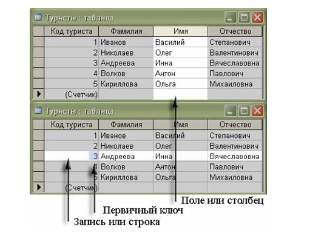


## ShagDB

## ЦЕЛЬ

Учебный проект, цель которого создание базы данных для академии ШАГ. База данных должна содержать информацию о студентах,
менеджерах, преподавателях и группах в академии, а также умение в команде работать и используя различные Системы Управления Версиями, сервисы и фреймворки.

## ЯЗЫКИ ИСПОЛЬЗОВАННЫЕ ПРИ РАЗРАБОТКЕ
SQLite, QT.

## Build status

## ЛИЦЕНЗИЯ

___

## Cкриншот
___
